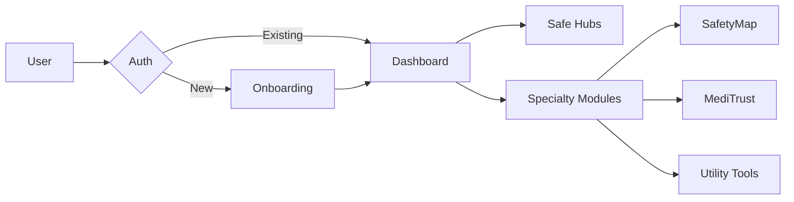

<p align="center">
  
</p>

<h1 align="center">🌍 Traviora - Redefining the Modern Travel Experience</h1>

<p align="center">
  <em>A high-performance, security-focused, and user-centric travel ecosystem built for the next generation of explorers.</em>
</p>

<p align="center">
  
  
  
  
</p>

<p align="center">
  <a href="https://traviora-mu.vercel.app/"><strong>🌐 Live Demo</strong></a> ·
  <a href="https://traviora-eltm.onrender.com/"><strong>⚙️ API Documentation</strong></a> ·
  <a href="https://youtu.be/PWAoM_ZNa-c?si=u0rsxavuuUojfXTS"><strong>▶️ YouTube Demo</strong></a> ·
  <a href="https://www.figma.com/design/OQwbFNggqCJZdl7C6mybOS/figma?node-id=5691-2&t=En3TKc6rHqFN2UlD-1"><strong>🎨 Figma Prototype</strong></a> ·
  <a href="#-key-features"><strong>Features</strong></a> ·
  <a href="#-local-development"><strong>Setup Guide</strong></a> ·
  <a href="#-architecture"><strong>Architecture</strong></a>
</p>

---

## 📖 Table of Contents
- [🚀 Overview](#-overview)
- [🎯 Motivation](#-motivation)
- [✨ Key Features](#-key-features)
- [🏗️ Architecture](#-architecture)
- [🛠️ Tech Stack](#️-tech-stack)
- [💻 Local Development](#-local-development)
- [🛣️ Roadmap](#️-roadmap)
- [🤝 Contributing](#-contributing)

---

## 🚀 Overview

**Traviora** is more than just a travel planner; it is a comprehensive safety and utility hub for travelers. By integrating real-time safety metrics, healthcare accessibility, and AI-powered utility modules, Traviora ensures that every trip is as safe as it is exciting.

### 🔗 Quick Links
- **Production Frontend:** [traviora-mu.vercel.app](https://traviora-mu.vercel.app/)
- **Production Backend:** [traviora-eltm.onrender.com](https://traviora-eltm.onrender.com/)
- **▶️ YouTube Demo:** [Watch the project demo on YouTube](https://youtu.be/PWAoM_ZNa-c?si=u0rsxavuuUojfXTS)
- **🎨 Figma Prototype:** [View the UI/UX design on Figma](https://www.figma.com/design/OQwbFNggqCJZdl7C6mybOS/figma?node-id=5691-2&t=En3TKc6rHqFN2UlD-1)

---

## 🎯 Motivation

Current travel platforms focus heavily on booking but neglect the **on-ground experience**, especially regarding:
1. **Safety**: Fragmented data on local safety zones.
2. **Health**: Difficulty finding trusted medical care in foreign locations.
3. **Utility**: Struggles with local menus, language barriers, and basic needs like charging points.

**Traviora solves this** by centralizing these essential services into one intuitive, elegant interface.

---

## ✨ Key Features

### 🌈 User Experience
- **Personalized Onboarding**: Tailored interface based on user preferences (Solo, Family, Adventure, etc.).
- **Gender-Specific Safe Hubs**: Optimized dashboards for Men, Women, and Families with relevant safety tips and local insights.
- **Dynamic Profile Management**: Full control over user identity, including real-time profile picture updates and personal info.

### 🛡️ Safety & Health (MediTrust & SafetyMap)
- **Real-Time Risk Scoring**: Area-specific safety ratings based on local data.
- **SOS Integration**: One-tap access to emergency contacts and nearby help.
- **Doctor Profiles**: Verified medical professionals with specialty filters and consultation transparency.

### ⚡ Utility Modules
- **PowerSpot**: Geo-targeted search for device charging stations.
- **MenuLens**: AI-powered menu scanning with automatic translation and allergen detection.
- **LocalVibe**: Discover hidden gems recommended by locals, not just tourists.

---

## 🏗️ Architecture

Traviora utilizes a modern **MERN** stack with a decoupled frontend/backend architecture to ensure scalability and high performance.

### 🔄 User Flow Diagram



### 📂 Directory Structure

| Directory | Description |
| :--- | :--- |
| `frontend/src/pages` | UI views for Auth, Dashboard, and Specialty modules. |
| `frontend/src/components` | Atomic UI components and Layout wrappers. |
| `backend/controllers` | Business logic for User Auth and Data processing. |
| `backend/models` | Mongoose schemas for persistence. |
| `backend/routes` | Express endpoints mapping. |

---

## 🛠️ Tech Stack

- **Frontend**:  
- **Backend**:  
- **Database**: 
- **Security**:  
- **Deployment**:  

---

## 💻 Local Development

Follow these steps to get a local copy up and running.

### 1. Prerequisites
- Node.js (v18+)
- MongoDB Atlas account or local instance

### 2. Installation
```bash
# Clone the repository
git clone https://github.com/Chiragprajapat003/traviora.git

# Install Backend Dependencies
cd backend
npm install

# Install Frontend Dependencies
cd ../frontend
npm install
```

### 3. Environment Setup
Create a `.env` file in the `backend` directory:
```env
PORT=5000
MONGO_URI=your_mongodb_uri
JWT_SECRET=your_secret_key
```

### 4. Running the App
```bash
# Start Backend (from /backend)
npm run dev

# Start Frontend (from /frontend)
npm run dev
```

---

## 🛣️ Roadmap

- [ ] **AI Trip Planner**: Generative AI itineraries based on budget and time.
- [ ] **Offline Maps**: Downloadable safety maps for low-connectivity zones.
- [ ] **Community Forums**: Peer-to-peer travel advice and safety warnings.
- [ ] **Booking Integration**: Direct flight/hotel booking with safety-score filters.

---

## 🤝 Contributing

Contributions are what make the open source community such an amazing place to learn, inspire, and create. Any contributions you make are **greatly appreciated**.

1. Fork the Project
2. Create your Feature Branch (`git checkout -b feature/AmazingFeature`)
3. Commit your Changes (`git commit -m 'Add some AmazingFeature'`)
4. Push to the Branch (`git push origin feature/AmazingFeature`)
5. Open a Pull Request

---

<p align="center">
  Developed with passion by <b>Chirag Prajapat</b><br>
  © 2026 Traviora Ecosystem. All rights reserved.
</p>